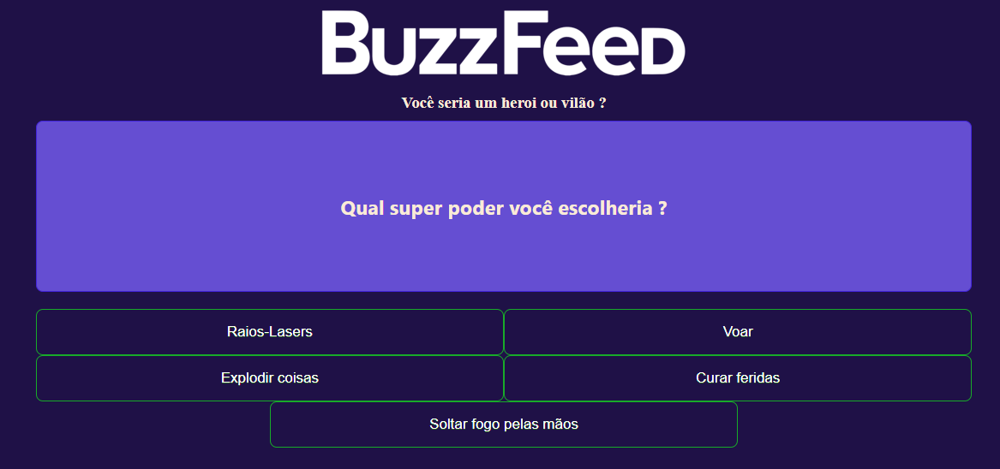

# ProjetoBuzzfeed

(This project was generated with [Angular CLI](https://github.com/angular/angular-cli) version 15.0.3.)
Projeto desenvolvido para o bootcamp da NTT DATA em parceria com a Dio e mentoria de Felipe Aguiar.

## Criando a estrutura base

Usando o ng, criei os componentes "página home" e "quizz". 

## Estilização do Projeto

Vimos na aula como criar o HTML e o CSS do projeto, deixando o projeto com uma cara mais amigável.

## Criando as propriedades lógicas

Criamos a lógica do jogo no componente "quizz", assim como utilizamos diretivas para renderizar páginas e percorrer arrays.

## Regras do jogo e cálculo do resultado

A parte mais complicada foi reproduzir a estatística das respostas, para renderizar a de maior ocorrência.

## O que eu achei do projeto

O projeto, apesar de desafiador, foi divertido de fazer, pois o Felipe Aguiar nos acompanha do início ao fim do projeto, nos dando mais segurança para concluí-lo.

